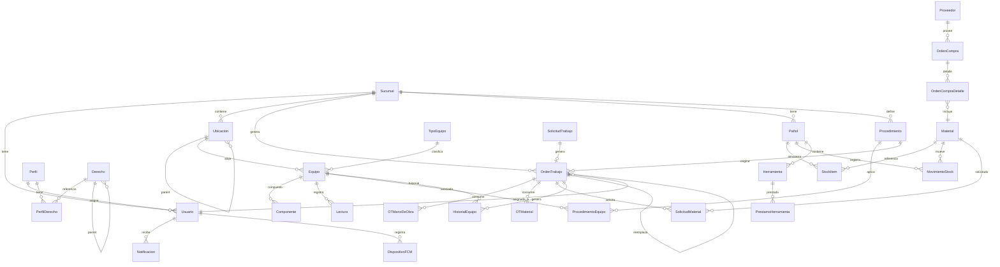
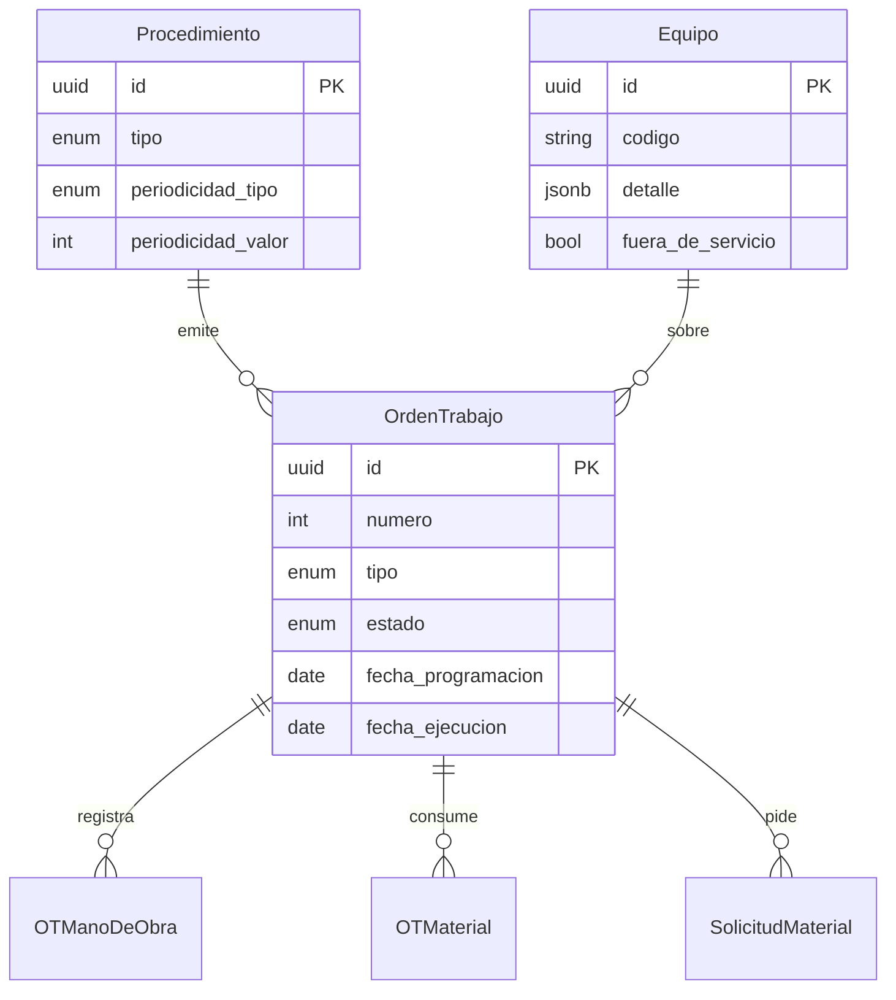
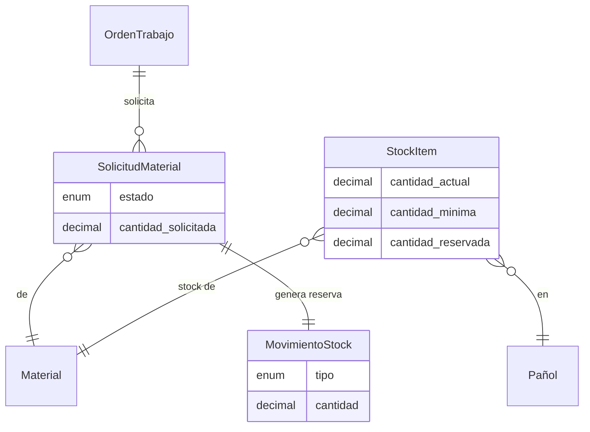

# 03 — Relaciones entre entidades

Diagrama ER y reglas de integridad.

## Diagrama principal



## Diagrama M3 — Mantenimiento (detalle)



## Diagrama M4 — Pañol (flujo stock)



---

## Reglas de integridad

### Aislamiento por sucursal (RLS)

Toda tabla con `sucursal_id` tiene política RLS:

```sql
-- Contexto de sesión (seteado por el backend en cada request)
SET app.current_sucursal_id = 'uuid-de-sucursal';
SET app.es_admin_global = false;
SET app.supervisa_sucursales = false;

-- Política base
CREATE POLICY sucursal_isolation ON orden_trabajo
  USING (
    sucursal_id = current_setting('app.current_sucursal_id')::uuid
    OR current_setting('app.es_admin_global')::boolean = true
    OR current_setting('app.supervisa_sucursales')::boolean = true
  );
```

Tablas con RLS: `Usuario`, `Ubicacion`, `Equipo`, `OrdenTrabajo`, `Procedimiento`, `Pañol`, `StockItem`, `MovimientoStock`, `OrdenCompra`, `SolicitudTrabajo`, `SolicitudMaterial`, `ValeConsumo`.

Tablas **sin** RLS (globales): `Perfil`, `Derecho`, `PerfilDerecho`, `TipoEquipo`, `Material`, `Proveedor`, catálogos generales.

### Cascadas

| Relación | ON DELETE |
|----------|-----------|
| Sucursal → Ubicacion | RESTRICT (no borrar sucursal con datos) |
| Ubicacion → Equipo | RESTRICT |
| Equipo → OrdenTrabajo | RESTRICT (no borrar equipo con OT) |
| OrdenTrabajo → OTManoDeObra | CASCADE |
| OrdenTrabajo → OTMaterial | CASCADE |
| OrdenTrabajo → SolicitudMaterial | CASCADE |
| Perfil → Usuario | RESTRICT |
| Material → StockItem | CASCADE |

### Restricciones de negocio

| Regla | Implementación |
|-------|----------------|
| Equipo solo en nodo hoja | Trigger: `ubicacion_id` no puede tener hijos |
| OT requiere equipo activo | Check: `equipo.fuera_de_servicio = false` al emitir |
| Stock no negativo | Check: `cantidad_actual >= 0` |
| Reserva ≤ stock disponible | Check: `cantidad_reservada <= cantidad_actual` |
| OC autorización por monto | Backend: `usuario.monto_maximo_oc >= oc.monto_total` |
| Usuario admin único reservado | Flag `es_administrador`, no editable desde árbol |

---

## Índices recomendados

```sql
-- Búsqueda de OT (pantalla más usada)
CREATE INDEX idx_ot_sucursal_estado ON orden_trabajo (sucursal_id, estado);
CREATE INDEX idx_ot_tecnico_estado ON orden_trabajo (tecnico_asignado_id, estado);
CREATE INDEX idx_ot_fecha_programacion ON orden_trabajo (fecha_programacion);
CREATE INDEX idx_ot_equipo ON orden_trabajo (equipo_id);

-- Árbol de ubicaciones
CREATE INDEX idx_ubicacion_parent ON ubicacion (parent_id, sucursal_id);

-- Stock
CREATE INDEX idx_stock_panol_material ON stock_item (pañol_id, material_id);
CREATE INDEX idx_movimiento_fecha ON movimiento_stock (pañol_id, fecha DESC);

-- Notificaciones
CREATE INDEX idx_notif_usuario_leida ON notificacion (usuario_id, leida, created_at DESC);

-- Permisos
CREATE INDEX idx_perfil_derecho ON perfil_derecho (perfil_id, derecho_id);
```

---

## Esquemas de PostgreSQL

```
public          → tablas transaccionales (M1-M5, M7)
analytics       → vistas materializadas de KPIs (M6)
audit           → log de cambios críticos (opcional fase 3)
```

La separación `analytics` evita que queries de indicadores compitan con la carga transaccional de técnicos en campo.
