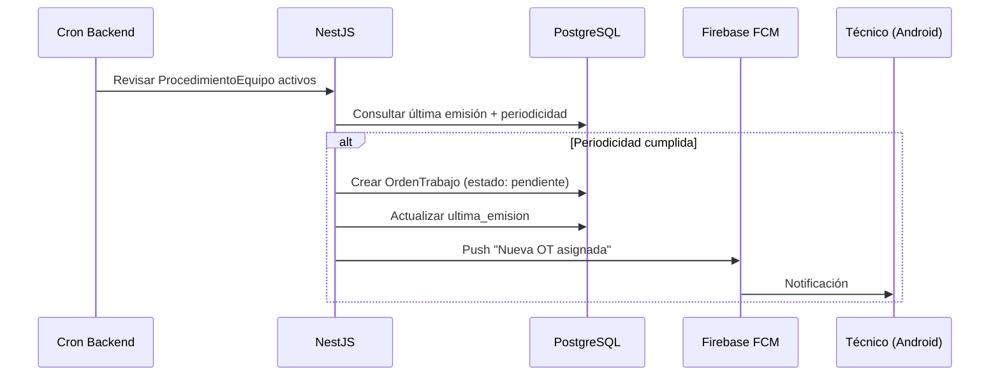
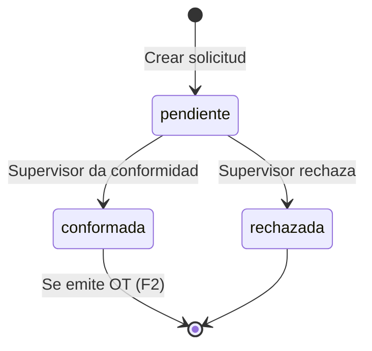
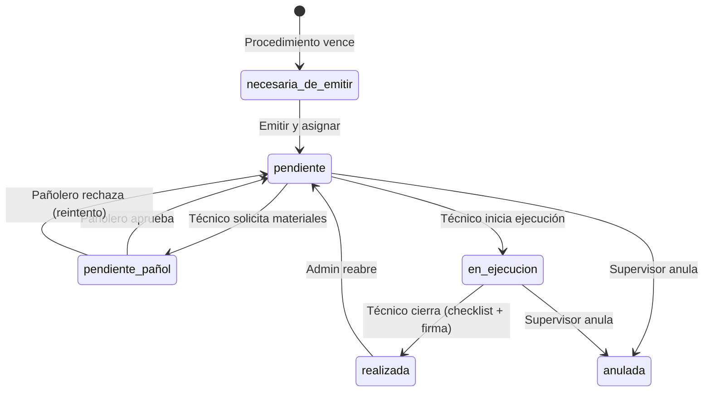
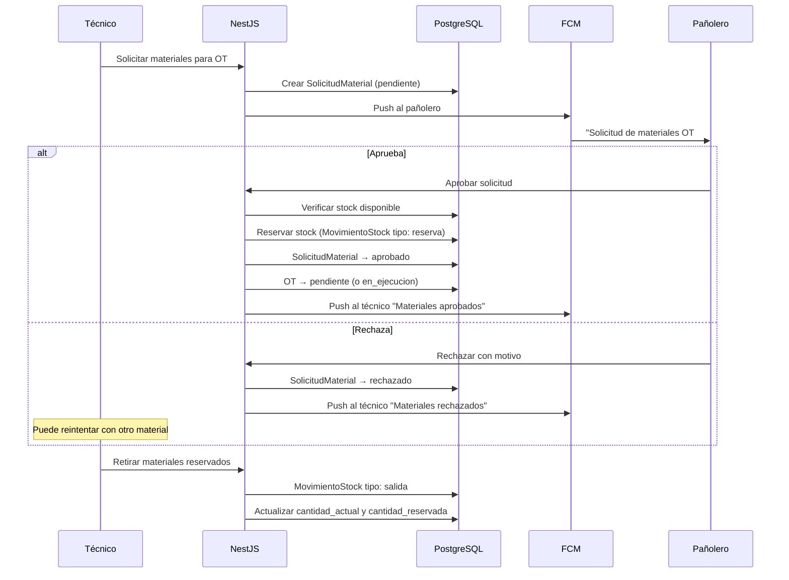
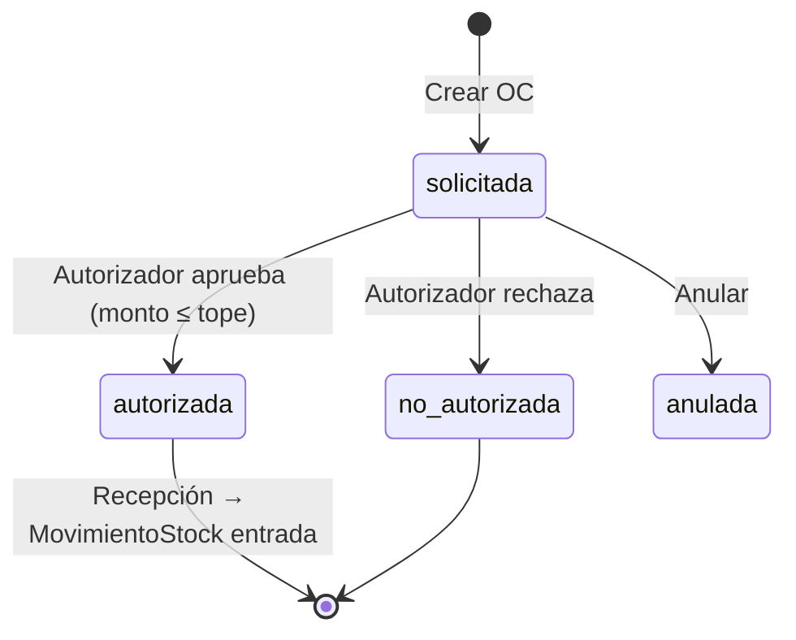
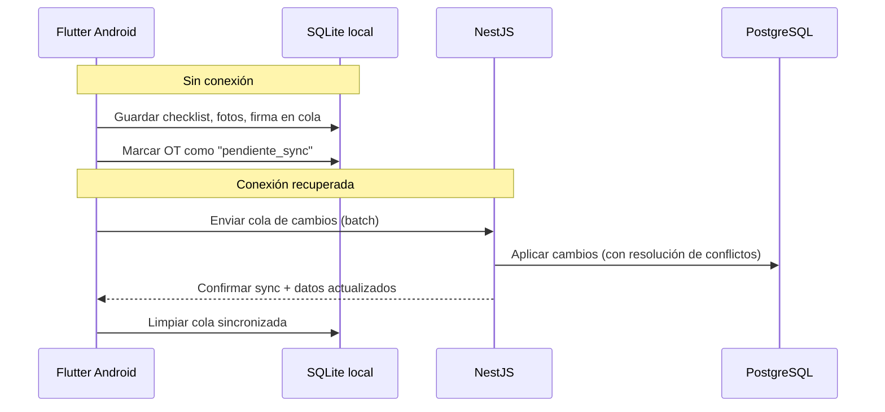

# 04 — Flujos de negocio

Procesos del sistema, no pantallas. Cada flujo define: actores, estados, transiciones y eventos de notificación.

---

## F1 — Emisión de OT periódica (automática)

**Actor:** Sistema (cron backend)
**Trigger:** Periodicidad de tiempo o umbral de contador



**Mejora vs SGMWin:** En el original esto corre en un PC prendido. Acá corre en la nube.

---

## F2 — Emisión de OT manual / no periódica

**Actores:** Derivador OT, Supervisor

```
1. Seleccionar equipo (árbol de ubicaciones)
2. Seleccionar procedimiento (o crear correctiva libre)
3. Definir fecha programación, técnico, prioridad
4. Verificar stock de materiales (si aplica)
   ├── Stock OK → estado: pendiente
   └── Falta stock → estado: pendiente_pañol
5. Notificar técnico (push)
```

---

## F3 — Solicitud de Trabajo → OT

**Actores:** Solicitante externo, Supervisor



Si `urgente = true` → push al supervisor inmediato.

---

## F4 — Ciclo de vida de OT (completo)



### Ejecución en campo (Android)

```
1. Técnico abre OT asignada
2. Completa checklist (planilla de lecturas)
3. Registra lecturas de contadores
4. Carga mano de obra (horas normales/extra)
5. Solicita materiales (si no lo hizo antes) → F5
6. Toma fotos
7. Firma digital
8. Marca como realizada
9. Stock se actualiza automáticamente
10. HistorialEquipo se genera
```

---

## F5 — Flujo OT + Pañol (aprobación de materiales)

**Actores:** Técnico, Pañolero
**Nuevo respecto a SGMWin**



---

## F6 — Alerta stock mínimo

**Actor:** Sistema
**Trigger:** `cantidad_actual - cantidad_reservada < cantidad_minima`

```
1. Job periódico revisa StockItem
2. Si stock bajo mínimo → crear Notificacion
3. Push al pañolero
4. Si OT pendiente depende de ese material → alerta preventiva
```

---

## F7 — Orden de Compra

**Actores:** Solicitante, Autorizador (con `monto_maximo_oc`)



Si `monto_total > umbral_configurado` → push al gerente.

---

## F8 — Emisión automática de OT (cron)

**Frecuencia:** Diario (configurable por sucursal)

```
Para cada ProcedimientoEquipo activo:
  1. Calcular próxima fecha según periodicidad_tipo:
     - tiempo: ultima_emision + periodicidad_valor días
     - contador: última lectura + periodicidad_valor unidades
  2. Si vencido → crear OT con estado necesaria_de_emitir
  3. Si auto_emitir configurado → pasar a pendiente y asignar
  4. Notificar técnico y supervisor
```

---

## F9 — Cálculo de índices (KPIs)

**Actor:** Sistema (job nocturno)
**Esquema:** `analytics`

```
1. Job corre en horario de baja carga (ej: 02:00)
2. Lee datos de orden_trabajo, lectura, ot_mano_obra
3. Calcula por equipo: TMEF, TMPR, TEMP, TPMP, IMC, IMP, ICO, ICM
4. Materializa en analytics.indices_equipo
5. Dashboard lee de analytics (sin impactar transaccional)
```

---

## F10 — Sincronización offline (Fase 3)

**Actor:** Técnico en zona sin señal



**Regla de conflictos:** El servidor gana (last-write-wins con timestamp del servidor).

---

## Resumen de flujos por fase

| Flujo | Fase | Módulos |
|-------|------|---------|
| F2 — OT manual | 1 | M2, M3, M7 |
| F4 — Ciclo OT (básico) | 1 | M3, M7 |
| F3 — Solicitud trabajo | 1 | M3 |
| F5 — Pañol aprobación | 2 | M3, M4, M7 |
| F1 — OT automática | 2 | M3, M7 |
| F7 — Orden de compra | 2 | M5, M7 |
| F6 — Alerta stock | 2 | M4, M7 |
| F8 — Cron emisión | 2 | M3 |
| F9 — KPIs | 3 | M6 |
| F10 — Offline sync | 3 | M3 |
