# Sistema SGwing

Documento visual de referencia de Sika (capturas del sistema legado + mejoras pedidas).

Las imágenes viven en esta misma carpeta: `docs/images/sgwing-01` … `sgwing-32`.

**Checklist de paridad:** [`../faltantes/sgwing-paridad.md`](../faltantes/sgwing-paridad.md) · **Estado del proyecto:** [`../00-estado-proyecto.md`](../00-estado-proyecto.md)

---

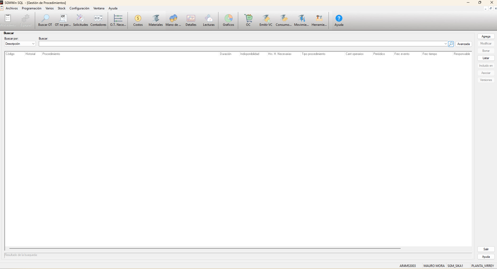

Esto es procedimiento, tenés para buscar por descripción, o código.
La búsqueda avanzada se rige por lo siguiente:

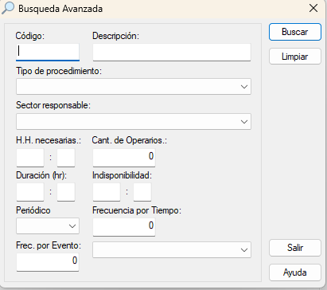

Cuando apretás el botón agregar procedimiento aparece esto:

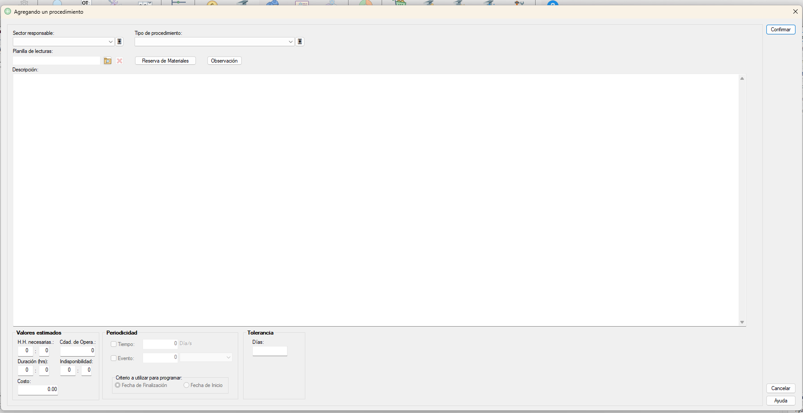

En reservar materiales aparece lo siguiente:

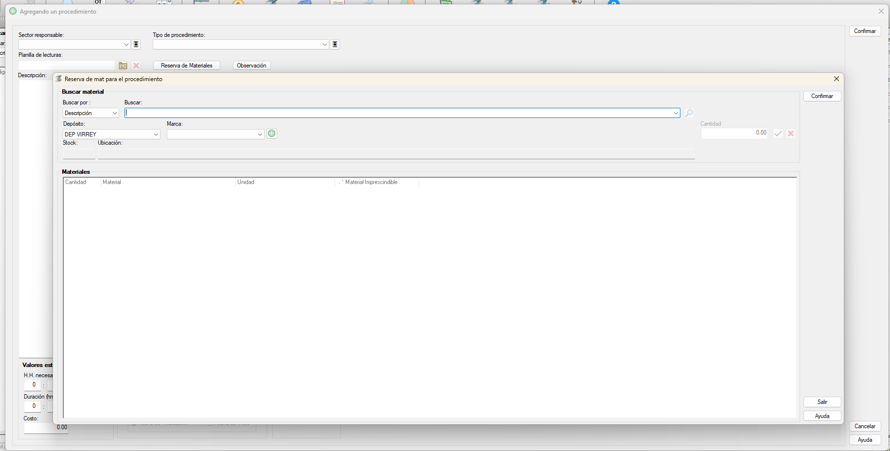

Si buscás un procedimiento nos aparece así:

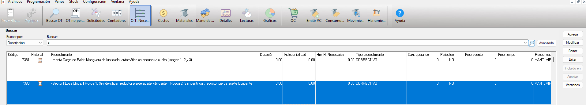

Esto nos deja listarlo (en Excel), modificarlo, eliminarlo, y solo si es preventivo te deja asociarlo a general, sector, o equipo.

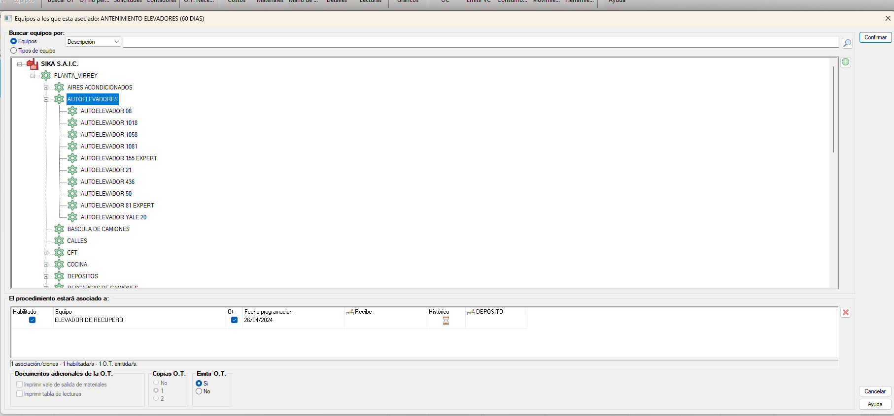

Esto es lo que aparece al apretar asociar: vos buscás el lugar, lo presionás y te aparece abajo que lo querés asociar a ese lugar, además de mostrarte opciones como imprimir OT, y emitir OT.

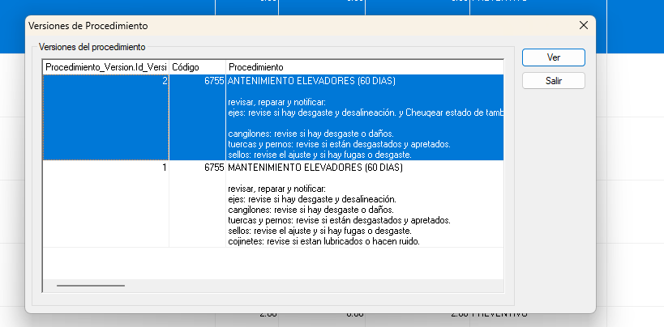

Aquí en versiones te muestra las que fuiste modificando dentro de la misma.

## Equipo

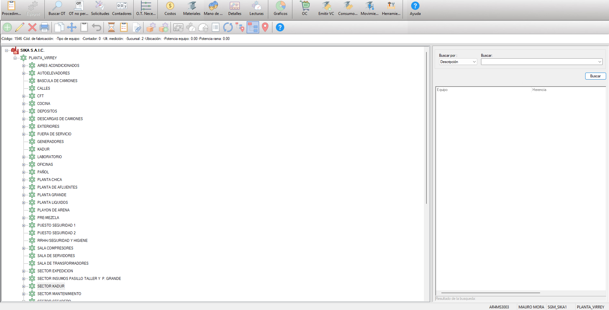

Te muestra toda la planta. Desde la planta madre SIKA, hasta el último sector y equipo.

Acá podés: agregar equipo, modificar algún equipo, eliminar equipos, listar equipos, copiar, mover, y pegar equipo.
Tenemos el historial del equipo:

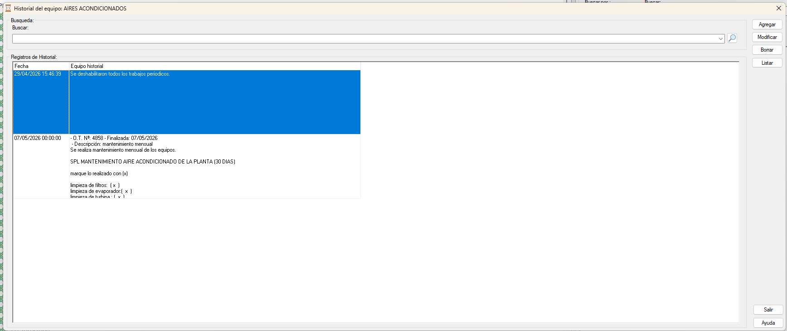

Muestra todas las órdenes de trabajo que se hicieron. O procedimientos.

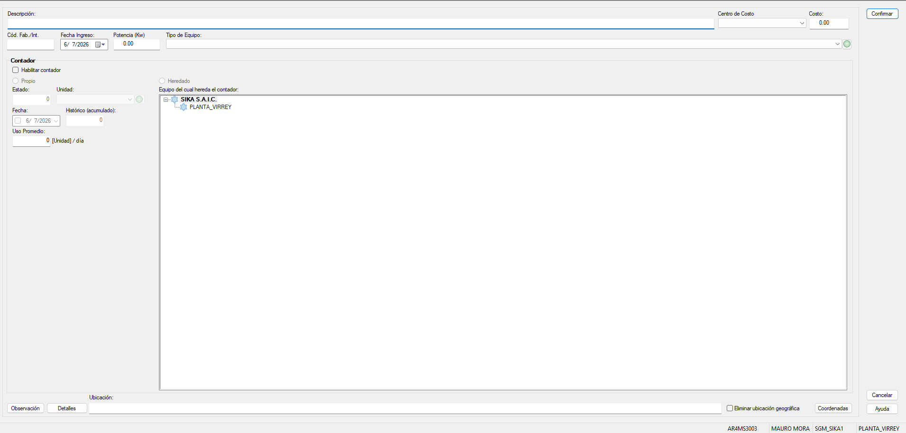

Cuando apretás agregar, primero tenés que pararte en el mapa de los equipos, en el sector que quieras agregar un equipo. Después le ponés el nombre (descripción), luego tenés varios ítems, como contador, cod. fabr., fecha de ingreso, potencia, tipo de equipo, pero todos son OPCIONALES.

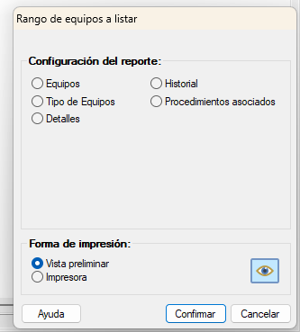

Para imprimir nos muestra estas opciones de reporte, seleccionamos la que necesitamos, luego vemos si queremos una lista de vista previa, o si queremos imprimir de una, y apretamos confirmar.

Dentro de equipo tenemos el botón de procedimientos asociados:

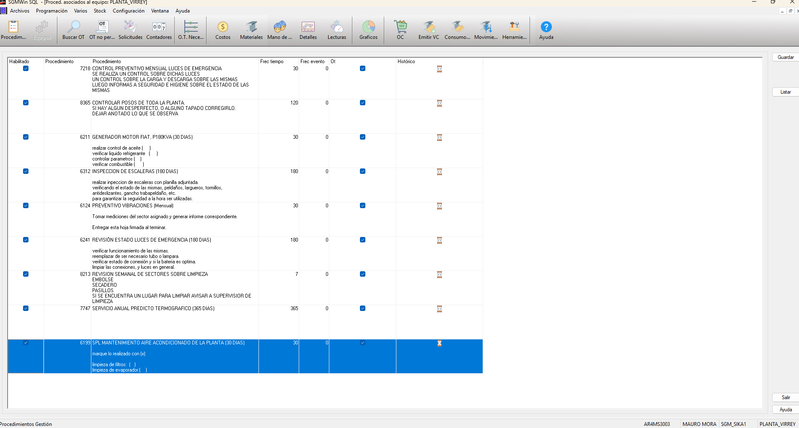

Acá nos muestra todos los procedimientos que tenemos asociados a cierto sector, máquina, o si tenemos asociado cosas a la planta general (solo muestra los procedimientos que tenemos asociados a la planta en ese caso, NO TODOS LOS QUE TENEMOS EN GENERAL).

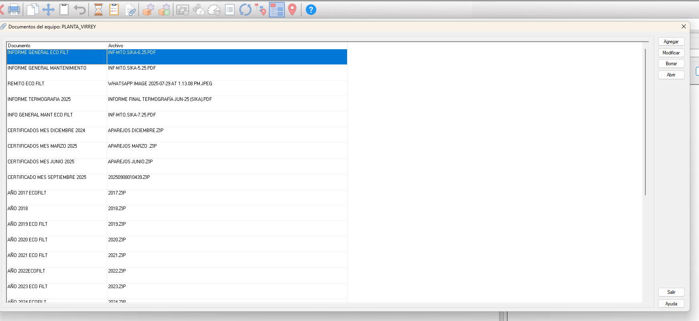

En documentos de equipo tenemos la opción de agregar al equipo documentos para especificar cosas, guardar informes, planos, videos, de todo.
Y va a quedar guardado con descripción y documento.

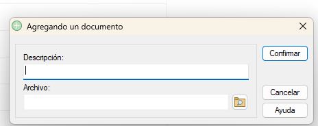

Si te parás en un archivo y apretás modificar, te deja modificar todo, desde la descripción hasta el archivo.

Si apretás abrir, te lo abre.

Luego tenemos dentro de equipo, listar y agregar repuesto a equipo.

---

## Órdenes de Trabajo (OT)

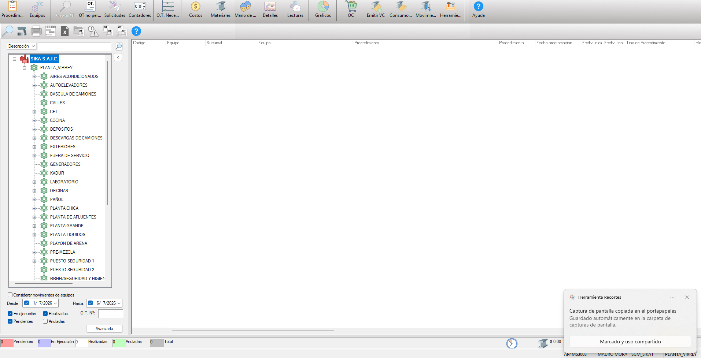

Aquí tenemos buscar OT, donde primero nos muestra en blanco y la parte del mapa de la planta, si queremos ver todas las OT de todos los sectores y máquinas, nos paramos en planta Virrey (en este caso esa sucursal), y si queremos buscar solo de X sector, lo buscamos, lo presionamos, y apretamos la lupa para buscar OT en ese sector.

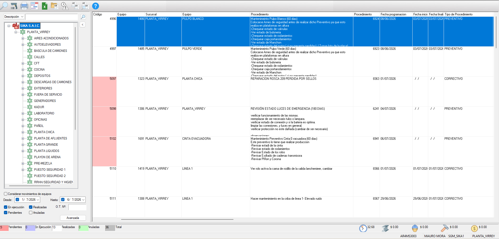

Acá cuando apretamos la lupa nos muestra estos datos.
En blanco porque están realizadas (yo las quiero en verde), en rojo si aún están pendientes, luego tenemos en ejecución que es violeta (pero yo las quiero en amarilla).

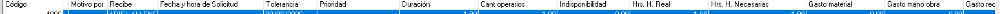

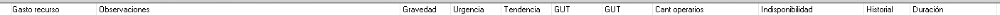

Bueno, acá como ves en las fotos tenemos: código, equipo, sucursal, equipo, procedimiento (descripción), procedimiento (número), fecha de programación, fecha de inicio, fecha de finalización, tipo de procedimiento (preventivo, correctivo, no periódico, etc.), motivo, recibe, fecha y hora de solicitud, tolerancia, prioridad, duración, cant. op., indisponibilidad, hs. hombre real, horas hombre necesarias, observaciones, gravedad, urgencia, tendencia, GUT, y historial de OT.

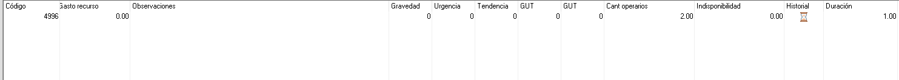

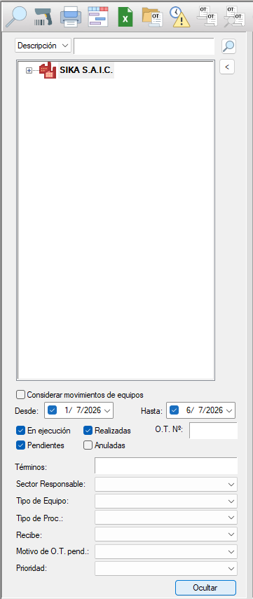

Acá tenemos para buscar las OT: desde/hasta, los estados, número de OT, términos (descripción), sector responsable, tipo de equipo, tipo de procedimiento, recibe, motivo de OT, prioridad.

---

Luego tenemos listar, que arma una vista preliminar de todas las OT que tenemos (opcional imprimir).

### Diagrama de Gantt

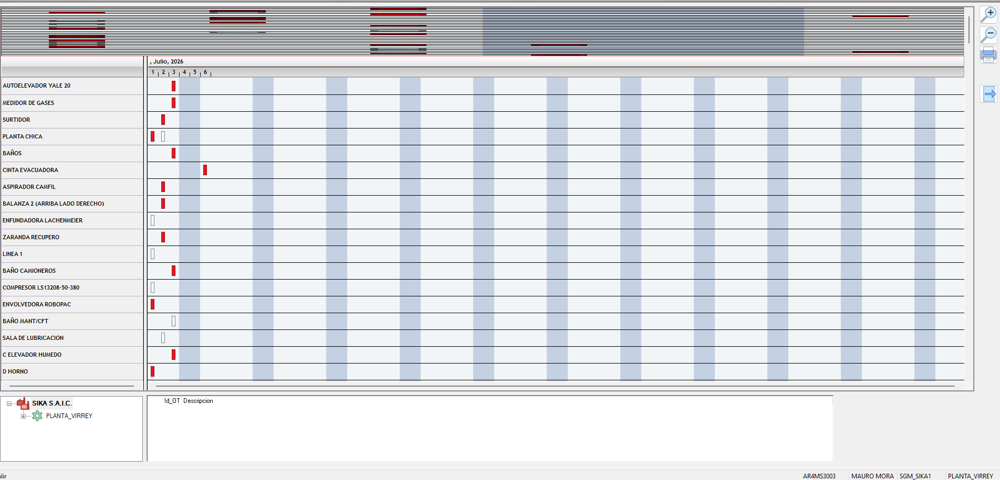

ROJO: lo que hay por hacer, muestra en el rango de fecha lo que tenemos para hacer.

### Emisión de OT derivada

Aquí seleccionamos una OT y al apretar emisión de OT derivada, lo que hacemos es asociar a la OT una pequeña OT derivada.

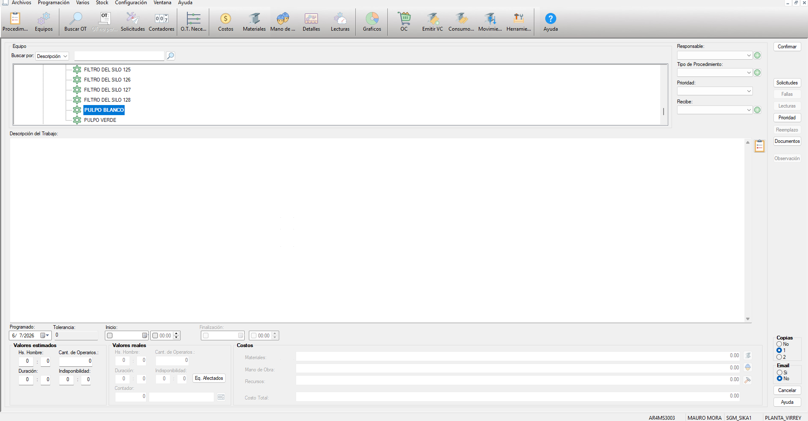

### OT no periódica

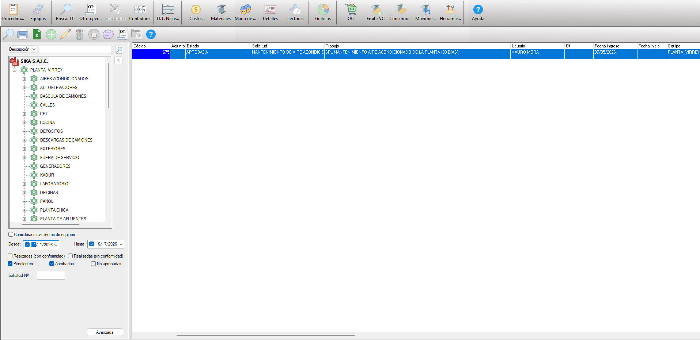

En OT no periódica tenemos para seleccionar el equipo o sector y armar una nueva OT teniendo en cuenta para cuándo se programa, inicio y finalización.
Quién recibe, el responsable, prioridad, tipo de procedimiento (no puede ser preventivo).

> **Mejora propuesta:** cuando ponemos "recibe", el sistema lo tendría que enviar al personal seleccionado vía aplicación. Y si quieren, se los podría imprimir para guardarlos en PDF.

### Solicitudes

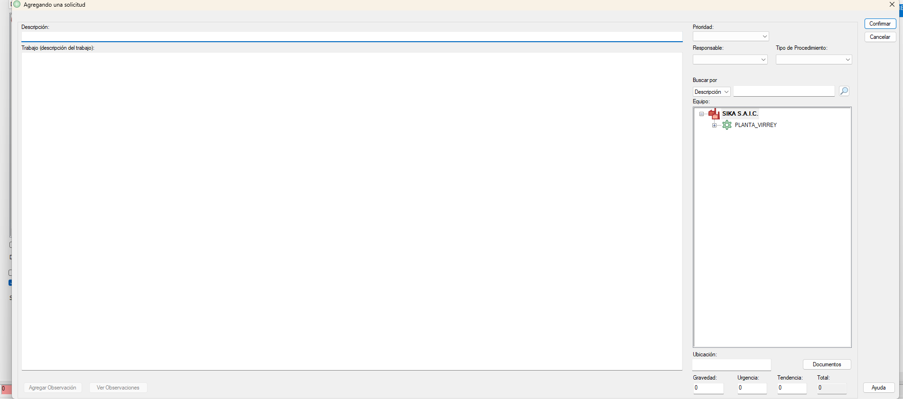

Agregamos, editamos, cambiamos el estado de la solicitud, observación (podemos dejarle un comentario), emitir OT, abrir OT.

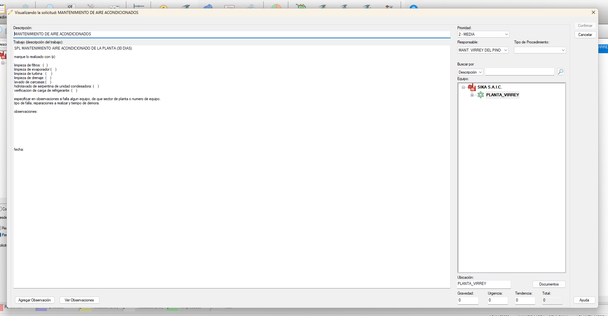

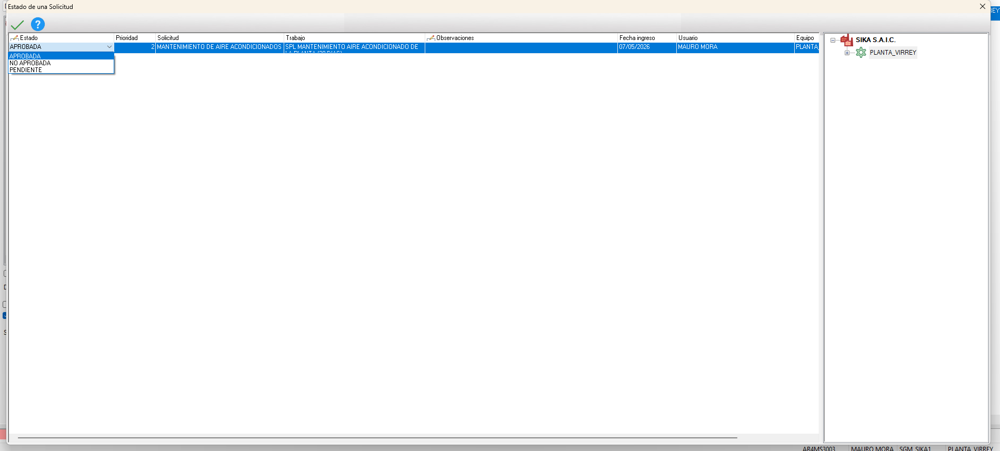

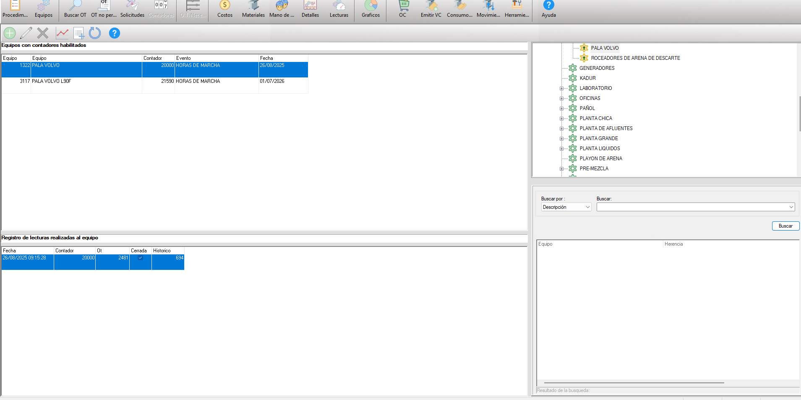

Contadores: muestra directamente los equipos habilitados para los contadores.

Tenemos para agregar, ver gráfico, ver todo, y reiniciar contador (este tiene que, para poder reiniciar contador, poner clave admin).

### OT Necesaria

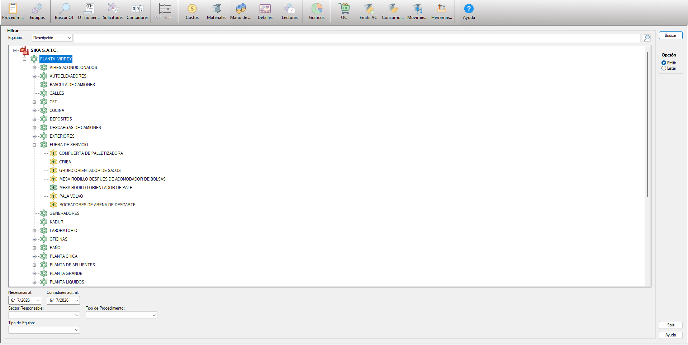

Seleccionamos el lugar que queramos ver las OT periódicas.

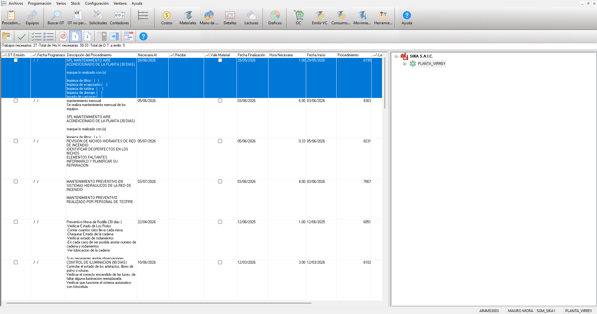

Al apretar la lupa nos muestra todas las próximas OT periódicas. Doble click para seleccionar las que están próximas a fecha. Y al apretar el check verde nos las manda a buscar OT, ya que las activa para realizarlas. Luego tiene que darnos una vista previa y la posibilidad de elegir quién la va a realizar, para luego mandarla al móvil del técnico correspondiente.

> Aclaración: si es un proveedor tercerizado, tiene que guardarla como PDF para luego imprimirla.
> Que tenga la opción de seleccionar todas, deseleccionar, imprimir 1 o 2 o no imprimir ninguna. Hacer diagrama de Gantt de la posible OT.

Y lo importante: cuando apretás la OT, quiero que muestre en el mapa del costado de qué sector o máquina es:

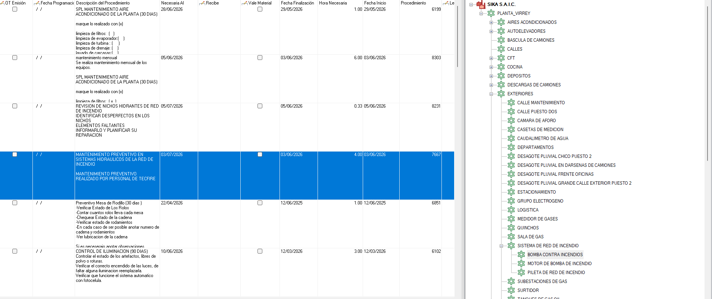
